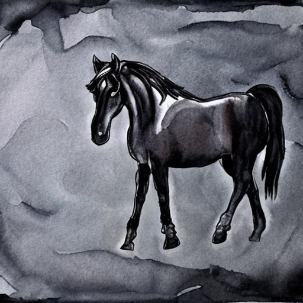
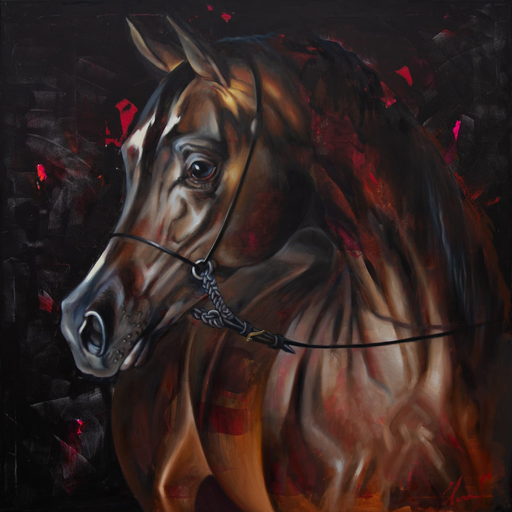
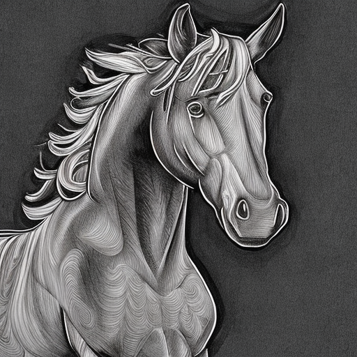

# Stable Diffusion LoRA Fine-Tuning with Custom Style

This project demonstrates how to fine-tune the Stable Diffusion model using Low-Rank Adaptation (LoRA) on a very small custom dataset. The goal was to capture the essence of a specific artist's style and apply it to image generation, leveraging modern optimization techniques to reduce GPU memory usage and training time.

Despite the small dataset size, the results are promising, though not perfect, showing how LoRA can be used effectively in style transfer tasks.

## Table of Contents

- [Project Overview](#project-overview)
- [Requirements](#requirements)
- [Installation](#installation)
- [Training Process](#training-process)
- [Image Generation](#image-generation)
- [Results](#results)
- [Future Work](#future-work)

## Project Overview

The project consists of multiple Jupyter notebooks and Python scripts that facilitate data preprocessing, model training, and image generation. LoRA is applied to the UNet component of the Stable Diffusion model, enabling fine-tuning on the small dataset while maintaining efficiency through various optimization techniques.

### Key Features:

- **LoRA Fine-tuning**: Efficient adaptation of Stable Diffusion using LoRA on a small dataset.
- **FP16 Quantization**: Reduces memory usage during training.
- **Gradient Accumulation**: Enables larger batch sizes without running out of GPU memory.
- **Attention Slicing and CPU Offload**: Memory optimization techniques to allow stable training even on smaller GPUs.

## Requirements

The project requires Python 3.12.3 and the following packages for generation:

- `os`
- `torch`
- `diffusers` (specifically: `StableDiffusionPipeline`, `UNet2DConditionModel`, `AutoencoderKL`)
- `matplotlib`
- `time`
- `datetime`

## Installation

1. Clone the repository:

```bash
git clone https://github.com/pavelMerlin/stable-diffusion-lora-style.git cd stable-diffusion-lora-style
```

2. Install the required dependencies:

```bash
pip install torch diffusers matplotlib
```

## Training Process

### Data Preprocessing:

Preprocess the dataset by resizing the images to the desired size (e.g., 512x512) using `data_preprocess.ipynb`. This ensures that the images are ready for the Stable Diffusion pipeline.

### LoRA Fine-Tuning:

Fine-tune the Stable Diffusion model using LoRA by running the notebook `LoRA.ipynb`. Key configurations:

- **Batch size**: 2-4 (with gradient accumulation).
- **FP16 quantization** for reduced memory usage.
- **Gradient accumulation** (4-8 steps, depending on data size).
- **CPU offload** to handle larger models on smaller GPUs.

The training prompt includes a unique token that captures the artist's style:
```bash
A painting in the style of <artg>
```

### Model Saving:

After each epoch, the LoRA weights are saved for later use in the generation step. These are stored as `.pt` files in the project directory.

## Image Generation

File with model weights are not provided because of memory limits.

Train model and load the LoRA weights and generate new images by running the `LoRA_generation.ipynb` notebook.

Provide a prompt for the generation. Example:

```bash
Draw a dark horse in the style of <artg> with lots of detail. A horse on a dark watercolor background.
```


Generated images are saved in the `model_results/` directory, organized by prompt.

## Results

The model was trained on a very small dataset, but despite this, the LoRA fine-tuning achieved visually pleasing results that somewhat capture the artist's unique style.

Generated images exhibit:

- Reasonable adherence to the prompt.
- Artistic style transfer from the small dataset.
- High-level details.

However, the small dataset size limits the diversity and precision of the results.

From Artist


Promt:
```bash
Draw a horse in the style of <artg> with lots of detail. A horse on a dark background.
```

From Model


## Future Work

- Increase dataset size to improve the variety and quality of generated images.
- Experiment with different LoRA ranks and configurations to fine-tune the model further.
- Explore using larger batch sizes and additional optimizations for better style transfer.
